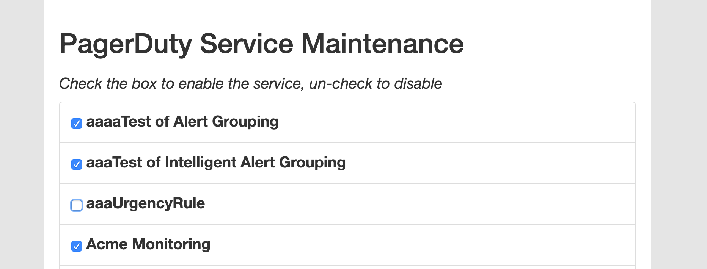
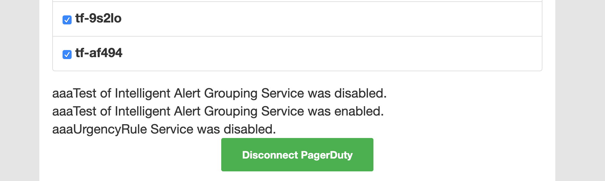

# PagerDuty Service Maintenance

This is a simple tool that showcases how to use [PKCE OAuth](https://v2.developer.pagerduty.com/docs/oauth-2-functionality-pkce) and the [PDJS](https://github.com/PagerDuty/pdjs) library to enable and disable services in [PagerDuty](https://www.pagerduty.com/).

A detailed explanation of the PKCE OAuth code can be found in the [pagerduty-bulk-user-mgr-sample](https://github.com/PagerDuty/pagerduty-bulk-user-mgr-sample#pkce-oauth-sample) project. Questions about the code in this project can either be posted as an Issue in GitHub, or on the [Developer Forum](https://community.pagerduty.com/c/dev/7) on the [PagerDuty Community](https://community.pagerduty.com/) site.

## Set Up Instructions
To run this code, do the following:
* Clone the repository
* Generate a clientId in PagerDuty. This is done by [Creating an App](https://v2.developer.pagerduty.com/v2/docs/how-to-build-an-app) and [Adding OAuth2 Functionality to your App](https://v2.developer.pagerduty.com/docs/oauth-2-functionality#section-add-oauth-2-functionality-to-your-app)
* in [`js/config.js`](js/config.js) set the values of `redirectUrl` with the value you entered while creating your app in PagerDuty, and `clientId` with the value generated while adding OAuth2 functionality
* Point your browser where ever you running the sample, and with the [`js/config.js`](js/config.js) correctly set, the sample should authenticate you and authorize the sample to grab a list of the services for your PagerDuty account. 

## How It Works
Once authenticated, the app will grab a list of Services from your PagerDuty account. Each service will have a checkbox. If the service is enabled the box will be checked, if disabled it will be unchecked. 

By checking and unchecking the boxes you will be enabling and disabling the corresponding service in your account. 

A list of the actions you take while using the sample will appear below the list of services. There, you will also see a button that will allow you to Disconnect the sample from your PagerDuty account. 

## Questions
If you have any questions or issues with this sample please post an Issue on this repository or create a post in the [PagerDuty Developer Community](https://community.pagerduty.com/c/dev/7).